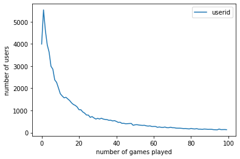
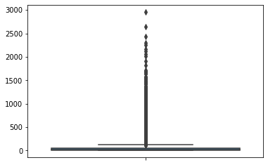
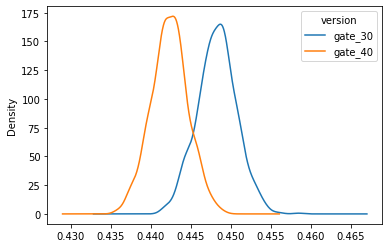
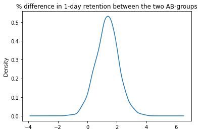
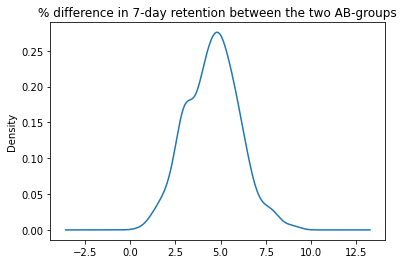

```python
!pip install xelatex
```

    ERROR: Could not find a version that satisfies the requirement xelatex (from versions: none)
    ERROR: No matching distribution found for xelatex
    


```python
from google.colab import drive
```


```python
drive.mount("/content/drive")
```

    Mounted at /content/drive
    


```python

#Python Imports
import re
import string
from collections import Counter


#Pandas
import pandas as pd
pd.set_option('display.max_rows', 500)
pd.set_option('display.max_columns',120)

#Numpy
import numpy as np


#Visualization
import matplotlib.pyplot as plt 
import seaborn as sns
import plotly.express as px
import plotly.graph_objects as px 

```


```python
df = pd.read_csv("/content/drive/My Drive/DS/ABTest/cookie_cats.csv",low_memory=False)
                 
```


```python
df.shape
```


    (90189, 5)


```python
df.head()
```


<div>
<style scoped>
    .dataframe tbody tr th:only-of-type {
        vertical-align: middle;
    }

    .dataframe tbody tr th {
        vertical-align: top;
    }

    .dataframe thead th {
        text-align: right;
    }
</style>
<table border="1" class="dataframe">
  <thead>
    <tr style="text-align: right;">
      <th></th>
      <th>userid</th>
      <th>version</th>
      <th>sum_gamerounds</th>
      <th>retention_1</th>
      <th>retention_7</th>
    </tr>
  </thead>
  <tbody>
    <tr>
      <th>0</th>
      <td>116</td>
      <td>gate_30</td>
      <td>3</td>
      <td>False</td>
      <td>False</td>
    </tr>
    <tr>
      <th>1</th>
      <td>337</td>
      <td>gate_30</td>
      <td>38</td>
      <td>True</td>
      <td>False</td>
    </tr>
    <tr>
      <th>2</th>
      <td>377</td>
      <td>gate_40</td>
      <td>165</td>
      <td>True</td>
      <td>False</td>
    </tr>
    <tr>
      <th>3</th>
      <td>483</td>
      <td>gate_40</td>
      <td>1</td>
      <td>False</td>
      <td>False</td>
    </tr>
    <tr>
      <th>4</th>
      <td>488</td>
      <td>gate_40</td>
      <td>179</td>
      <td>True</td>
      <td>True</td>
    </tr>
  </tbody>
</table>
</div>


```python
df.isna().sum()
```


    userid            0
    version           0
    sum_gamerounds    0
    retention_1       0
    retention_7       0
    dtype: int64


# The data is from **90,189** players that installed the game while the AB-test was running. <br>
The variables are:

* **userid** - a unique number that identifies each player.
* **version** - whether the player was put in the control group (gate_30 - a gate at level 30) or the test group (gate_40 - a gate at level 40).
* **sum_gamerounds** - the number of game rounds played by the player during the * first week after installation
* **retention_1** - did the player come back and play 1 day after installing?
* **retention_7** - did the player come back and play 7 days after installing?
When a player installed the game, he or she was randomly assigned to either gate_30 or gate_40.

Count distribution across Both groups


```python
df['version'].value_counts(normalize=True)
```


    gate_40    0.504374
    gate_30    0.495626
    Name: version, dtype: float64


We see, the proportion of Control group and Test group is almost same

How many players of Gate_40 are retained for 1 day


```python
count_by_gamerounds = df[['userid','sum_gamerounds']].groupby(by='sum_gamerounds').count()
count_by_gamerounds.columns = ['Number_of_Players']
count_by_gamerounds.head()
```


<div>
<style scoped>
    .dataframe tbody tr th:only-of-type {
        vertical-align: middle;
    }

    .dataframe tbody tr th {
        vertical-align: top;
    }

    .dataframe thead th {
        text-align: right;
    }
</style>
<table border="1" class="dataframe">
  <thead>
    <tr style="text-align: right;">
      <th></th>
      <th>Number_of_Players</th>
    </tr>
    <tr>
      <th>sum_gamerounds</th>
      <th></th>
    </tr>
  </thead>
  <tbody>
    <tr>
      <th>0</th>
      <td>3994</td>
    </tr>
    <tr>
      <th>1</th>
      <td>5538</td>
    </tr>
    <tr>
      <th>2</th>
      <td>4606</td>
    </tr>
    <tr>
      <th>3</th>
      <td>3958</td>
    </tr>
    <tr>
      <th>4</th>
      <td>3629</td>
    </tr>
  </tbody>
</table>
</div>


```python
ax = count_by_gamerounds.head(100).plot()
ax.set_xlabel("number of games played")
ax.set_ylabel("number of users")
```


    Text(0, 0.5, 'number of users')





The distribution is highly skewed, with a long tail on the right. A huge number of players played fewer than 20 rounds and left the game. For rounds greater than 60, the number of players stayed steady at about 300.


```python
# df['sum_gamerounds'].plot.box(figsize=(5,10))
sns.boxplot(y=df['sum_gamerounds'].values)
```


    <matplotlib.axes._subplots.AxesSubplot at 0x7ff467973ef0>





Removing outlier row where sum_gamerounds is around 50000


```python
df.drop(df[df['sum_gamerounds']>=40000].index, inplace = True)
```


```python
# df['sum_gamerounds'].plot.box(figsize=(5,10))
sns.boxplot(y=df['sum_gamerounds'].values)
```


    <matplotlib.axes._subplots.AxesSubplot at 0x7ff4673c9940>


```python
df['sum_gamerounds'].describe()
```


    count    90188.000000
    mean        51.320253
    std        102.682719
    min          0.000000
    25%          5.000000
    50%         16.000000
    75%         51.000000
    max       2961.000000
    Name: sum_gamerounds, dtype: float64


As we can see, 50% of players played fewer than 16 game rounds during the first week after installation, and 75% of players played fewer than 51 rounds.

Nearly 4000 players did not even play a single round after installation. Possible reasons may include:

They downloaded a number of new games at the same time and were attracted by other games.
They opened the app but did not like the design/interface/music, so they quit even before playing the game.
They have not started playing the game yet.
<br> 
<br>

Another number worth attention is that more than 14,000 players played fewer than three rounds. For these players, the reasons for leaving may include:

They did not enjoy the game. (This is probably the most common reason).
The game turned out to be different from what they expected.
The game was too easy and they got bored of it.
<br>
<br>

It is important to understand why a large number of players quit the game at an early stage. Tactile Entertainment can try to collect player feedback, for example, through an in-app survey.


```python
df[df['retention_1']==True].count()*100/df['retention_1'].count()
```


    userid            44.521444
    version           44.521444
    sum_gamerounds    44.521444
    retention_1       44.521444
    retention_7       44.521444
    dtype: float64


```python
df[df['retention_7']==True].count()*100/df['retention_7'].count()
```


    userid            18.605579
    version           18.605579
    sum_gamerounds    18.605579
    retention_1       18.605579
    retention_7       18.605579
    dtype: float64


## Comparing 1- Day Retention for each A-B group


```python
df.groupby('version')['retention_1'].mean()
```


    version
    gate_30    0.448198
    gate_40    0.442283
    Name: retention_1, dtype: float64


## Comparing 7 Day Retention for each A-B group


```python
df.groupby('version')['retention_7'].mean()
```


    version
    gate_30    0.190183
    gate_40    0.182000
    Name: retention_7, dtype: float64


It appears that there was a slight decrease in 1-day retention when the gate was moved to level 40 (44.2%) compared to the control when it was at level 30 (44.8%). It's a small change, but even small changes in retention can have a large impact. But while we are certain of the difference in the data, how certain should we be that a gate at level 40 will be worse in the future?

There are a couple of ways we can get at the certainty of these retention numbers. Here we will use bootstrapping: We will repeatedly re-sample our dataset (with replacement) and calculate 1-day retention for those samples. The variation in 1-day retention will give us an indication of how uncertain the retention numbers are.


Bootstrapping: Should we be confident in the difference?


```python
# Creating an list with bootstrapped means for each AB-group
boot_1d = []
for i in range(1000):
    boot_mean = df.sample(frac = 1,replace = True).groupby('version')['retention_1'].mean()
    boot_1d.append(boot_mean)
    
# Transforming the list to a DataFrame
boot_1d = pd.DataFrame(boot_1d)
    
# A Kernel Density Estimate plot of the bootstrap distributions
boot_1d.plot(kind='density')
```


    <matplotlib.axes._subplots.AxesSubplot at 0x7f0a76e478d0>





These two distributions above represent the bootstrap uncertainty over what the underlying 1-day retention could be for the two AB-groups. There seems to be some evidence of a difference, albeit small. Let's plot the % difference to have a closer look.


```python
boot_1d.head()
```


<div>
<style scoped>
    .dataframe tbody tr th:only-of-type {
        vertical-align: middle;
    }

    .dataframe tbody tr th {
        vertical-align: top;
    }

    .dataframe thead th {
        text-align: right;
    }
</style>
<table border="1" class="dataframe">
  <thead>
    <tr style="text-align: right;">
      <th>version</th>
      <th>gate_30</th>
      <th>gate_40</th>
    </tr>
  </thead>
  <tbody>
    <tr>
      <th>retention_1</th>
      <td>0.449741</td>
      <td>0.437246</td>
    </tr>
    <tr>
      <th>retention_1</th>
      <td>0.451816</td>
      <td>0.441358</td>
    </tr>
    <tr>
      <th>retention_1</th>
      <td>0.448291</td>
      <td>0.444074</td>
    </tr>
    <tr>
      <th>retention_1</th>
      <td>0.450427</td>
      <td>0.441869</td>
    </tr>
    <tr>
      <th>retention_1</th>
      <td>0.448662</td>
      <td>0.442401</td>
    </tr>
  </tbody>
</table>
</div>


```python
# Adding a column with the % difference between the two AB-groups
boot_1d['diff'] = (boot_1d.gate_30 - boot_1d.gate_40)/boot_1d.gate_40*100

# Ploting the bootstrap % difference
ax = boot_1d['diff'].plot(kind='density')
ax.set_title('% difference in 1-day retention between the two AB-groups')

# Calculating the probability that 1-day retention is greater when the gate is at level 30
print('Probability that 1-day retention is greater when the gate is at level 30:',(boot_1d['diff'] > 0).mean())
```

    Probability that 1-day retention is greater when the gate is at level 30: 0.96
    





From this chart, we can see that the most likely % difference is around 1% - 2%, and that 96% of the distribution is above 0%, in favor of a gate at level 30. 


```python
boot_1d.head()
```


<div>
<style scoped>
    .dataframe tbody tr th:only-of-type {
        vertical-align: middle;
    }

    .dataframe tbody tr th {
        vertical-align: top;
    }

    .dataframe thead th {
        text-align: right;
    }
</style>
<table border="1" class="dataframe">
  <thead>
    <tr style="text-align: right;">
      <th>version</th>
      <th>gate_30</th>
      <th>gate_40</th>
      <th>diff</th>
    </tr>
  </thead>
  <tbody>
    <tr>
      <th>retention_1</th>
      <td>0.449741</td>
      <td>0.437246</td>
      <td>2.857707</td>
    </tr>
    <tr>
      <th>retention_1</th>
      <td>0.451816</td>
      <td>0.441358</td>
      <td>2.369461</td>
    </tr>
    <tr>
      <th>retention_1</th>
      <td>0.448291</td>
      <td>0.444074</td>
      <td>0.949586</td>
    </tr>
    <tr>
      <th>retention_1</th>
      <td>0.450427</td>
      <td>0.441869</td>
      <td>1.936873</td>
    </tr>
    <tr>
      <th>retention_1</th>
      <td>0.448662</td>
      <td>0.442401</td>
      <td>1.415214</td>
    </tr>
  </tbody>
</table>
</div>


## Comparing 7-day Retention

The bootstrap analysis tells us that there is a high probability that 1-day retention is better when the gate is at level 30. However, since players have only been playing the game for one day, it is likely that most players haven't reached level 30 yet. That is, many players won't have been affected by the gate, even if it's as early as level 30.

But after having played for a week, more players should have reached level 40, and therefore it makes sense to also look at 7-day retention.


```python
df.groupby('version')['retention_7'].sum() / df.groupby('version')['retention_7'].count()
```


    version
    gate_30    0.190183
    gate_40    0.182000
    Name: retention_7, dtype: float64


**Insights:**

Like with 1-day retention, 7-day retention is slightly lower when the gate is at level 40 (18.2%) than when the gate is at level 30 (19.0%).
This difference is also larger than for 1-day retention, presumably because more players have had time to hit the first gate.
The overall 7-day retention is lower than the overall 1-day retention; fewer people play a game a week after installing than a day after installing. 

But as before, let's use bootstrap analysis to figure out how certain we should be of the difference between the AB-groups.


```python
# Creating a list with bootstrapped means for each AB-group
boot_7d = []
for i in range(500):
    boot_mean = df.sample(frac=1,replace=True).groupby('version')['retention_7'].mean()
    boot_7d.append(boot_mean)
    
# Transforming the list to a DataFrame
boot_7d = pd.DataFrame(boot_7d)

# Adding a column with the % difference between the two AB-groups
boot_7d['diff'] = (boot_7d.gate_30 - boot_7d.gate_40)/boot_7d.gate_40*100

# Ploting the bootstrap % difference
ax = boot_7d['diff'].plot(kind='density')
ax.set_title('% difference in 7-day retention between the two AB-groups')

# Calculating the probability that 7-day retention is greater when the gate is at level 30
print('Probability that 7-day retention is greater when the gate is at level 30:',(boot_7d['diff'] > 0).mean())
```

    Probability that 7-day retention is greater when the gate is at level 30: 1.0
    





**Conclusion**
The bootstrap result tells us that there is strong evidence that 7-day retention is higher when the gate is at level 30 than when it is at level 40. The conclusion is: If we want to keep retention high — both 1-day and 7-day retention — we should not move the gate from level 30 to level 40.

There are, of course, other metrics we could look at, like the number of game rounds played or how much in-game purchases are made by the two AB-groups. But retention is one of the most important metrics. If we don't retain our player base, it doesn't matter how much money they spend in-game.


```python

```
